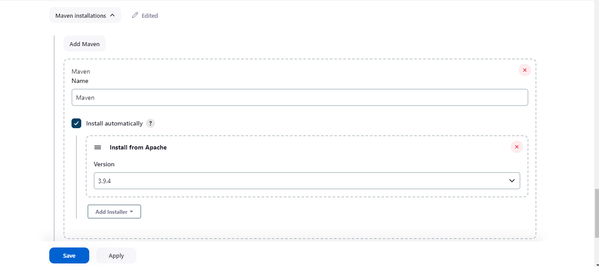
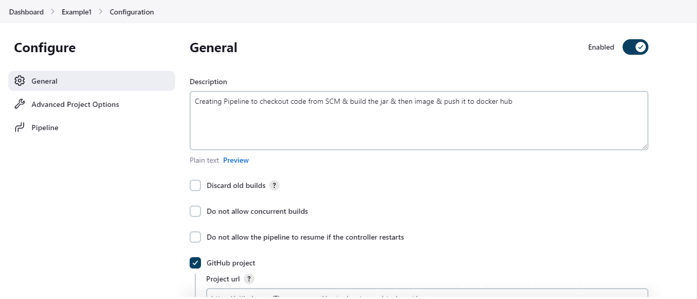
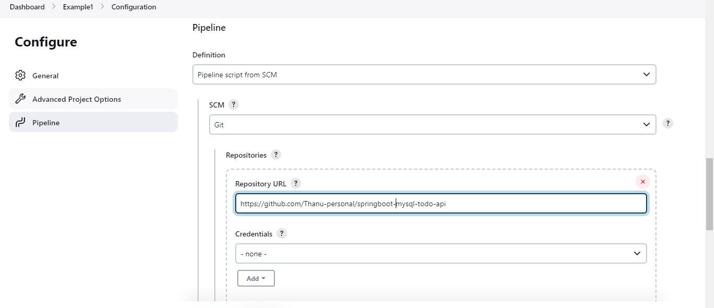
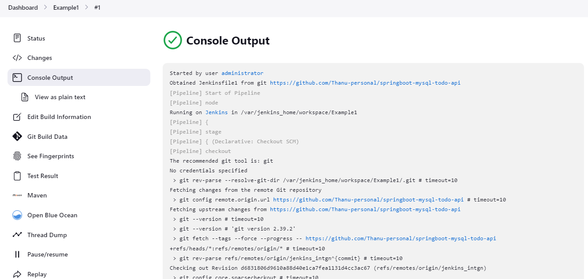
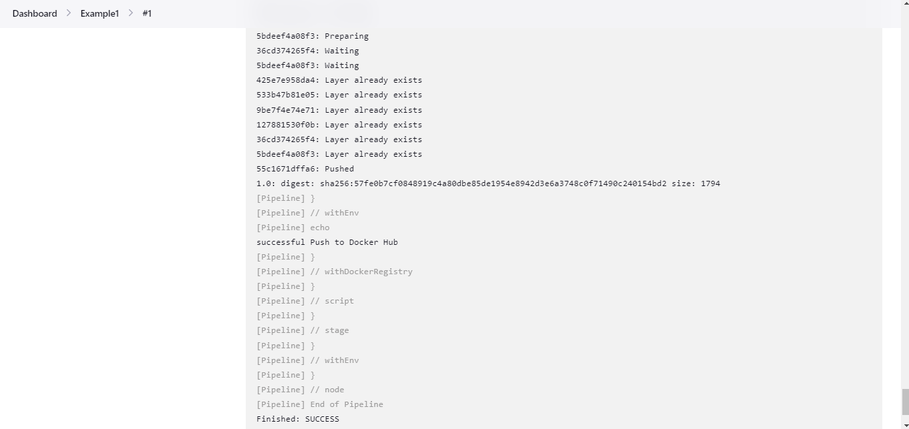
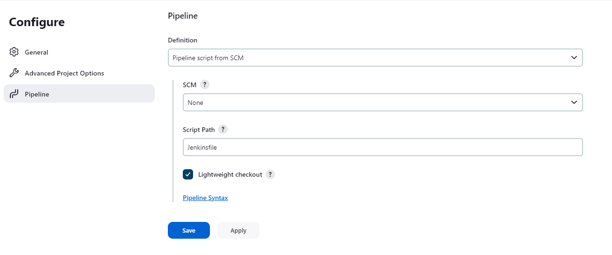
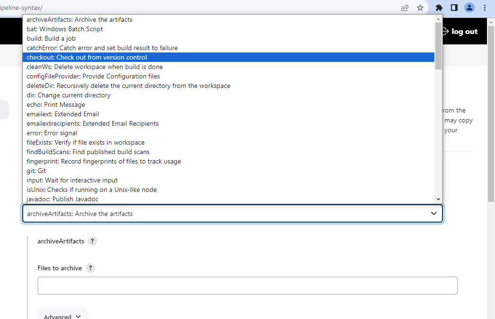
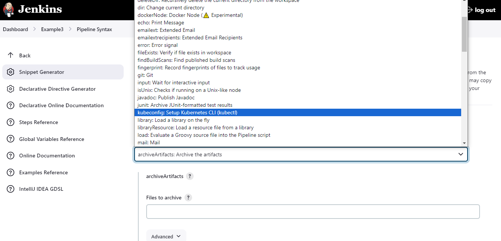

# Run jenkins on docker 

[Click here to install jenkins](https://www.jenkins.io/doc/book/installing/docker/)


```
# Create docker network
docker network create jenkins

# Run docker daemon exposed with port 2376
docker run --name jenkins-docker --rm --detach ^
  --privileged --network jenkins --network-alias docker ^
  --env DOCKER_TLS_CERTDIR=/certs ^
  --volume jenkins-docker-certs:/certs/client ^
  --volume jenkins-data:/var/jenkins_home ^
  --publish 2376:2376 ^
  docker:dind

# Create a docker file to customise and work with docker desktop & kubernetes,helm plugins installed
FROM jenkins/jenkins:2.414.1-jdk17
USER root
RUN apt-get update && apt-get install -y lsb-release
RUN curl -fsSLo /usr/share/keyrings/docker-archive-keyring.asc \
  https://download.docker.com/linux/debian/gpg
RUN echo "deb [arch=$(dpkg --print-architecture) \
  signed-by=/usr/share/keyrings/docker-archive-keyring.asc] \
  https://download.docker.com/linux/debian \
  $(lsb_release -cs) stable" > /etc/apt/sources.list.d/docker.list
RUN apt-get update && apt-get install -y docker-ce-cli

# Add Kubernetes repository and install kubectl
RUN curl -fsSL https://packages.cloud.google.com/apt/doc/apt-key.gpg | gpg --dearmor -o /usr/share/keyrings/kubernetes-archive-keyring.gpg
RUN echo "deb [arch=$(dpkg --print-architecture) signed-by=/usr/share/keyrings/kubernetes-archive-keyring.gpg] https://apt.kubernetes.io/ kubernetes-xenial main" > /etc/apt/sources.list.d/kubernetes.list
RUN apt-get update && apt-get install -y kubectl

# Install Helm
RUN curl -fsSL -o get_helm.sh https://raw.githubusercontent.com/helm/helm/master/scripts/get-helm-3 && \
    chmod +x get_helm.sh && \
    ./get_helm.sh && \
    rm get_helm.sh

USER jenkins
RUN jenkins-plugin-cli --plugins "blueocean docker-workflow"

# Build the customised image 
docker build -t myjenkins-blueocean:2.414.1-3 .

# Run the image
docker run --name jenkins-blueocean --restart=on-failure --detach ^
  --network jenkins --env DOCKER_HOST=tcp://docker:2376 ^
  --env DOCKER_CERT_PATH=/certs/client --env DOCKER_TLS_VERIFY=1 ^
  --volume jenkins-data:/var/jenkins_home ^
  --volume jenkins-docker-certs:/certs/client:ro ^
  --publish 8080:8080 --publish 50000:50000 myjenkins-blueocean:2.414.1-3

```

**NOTE:**
1. After these installation steps, make sure 2 containers are running. One is docker daemon exposed on port 2376(This is required for jenkins to use docker for builds, etc..) and other is the jenkins container. This is DinD(Docker in Docker)
2. You can also run jenkins & install docker plugins inside jenkins (Docker installated inside docker container)


# Step up admin details 

- Access the jenkins application in localhost:8080
- Login with default credentials - To get the password , go to the shown directory or simply run docker logs containerId & get the password from logs.
- Install suggested plugins 
- Create new user 'administrator' with password 'admin@123'
- Now start jenkins

# Prerequisites: Maven & Docker configuration 

NOTE: To run the examples, modify the `Dockerfile` and `Jenkinsfile` content accordingly (Provided in the example section)

## Maven Configuration 

- Go to manage jenkins -> plugins 
- Under Available plugins -> Choose `Maven Integration` and `Pipeline Maven Integration` and install 
- Once it is installed, configure it in `Manage Jenkins -> tools`
- Scroll to the `Maven Installation` section -> `Maven Installation` 
- Give name as `Maven` and check `install automatically`
- Apply and Save 




## Docker configuration 

- Since we are running `dnd` image. We dont have to install any docker additional plugins 
- We use docker deamon running on host machine itself for `docker`
- We only need to configure the docker hub repository credentials 
- Go to `Manage Jenkins -> Credentials`
- Click on `global`
- Now click on `Add Credentials`
- Select kind as `Username and password`
- Scope keep it default to `global`
- Enter dockerhub username `swayaanthanu`
- Enter password - ********
- Give description as `Docker credentials`
- click on create 

# Example 1: Creating Pipeline to checkout code from SCM & build the jar & then image & push it to docker hub

1. Click on new item  
2. Give name as `Example1`
3. Select `Pipeline`
4. Click `ok`
5. Now give decription as `Creating Pipeline to checkout code from SCM & build the jar & then image & push it to docker hub`
    
6. Scroll down to pipeline 
7. Select `Pipeline from SCM`
    
8. Select SCM as `Git`
9. Give your project repository url `https://github.com/Thanu-personal/springboot-mysql-todo-api`
10. Select Branch as `*/jenkins_intgn`
11. Scroll down to script path & type the jenkinsfile you want to execute. In my case, I have named it as `Jenkinsfile1` for this example
12. Apply and save
13. Now select your pipeline `Example1` and click on `Build now`
14. You can check the status of your build in `console output`





NOTE: You can use `pipeline script to generate script for you`

## Dockerfile content:

```
FROM openjdk:11.0.15-jre
ADD target/*.jar app.jar
ENTRYPOINT ["java","-jar","app.jar"]

```

## Jenkinsfile Content:

```
#File: Jenkinsfile1
pipeline {
    agent any

    
    stages {
        stage('Checkout') {
            steps {
                # This is generated using pipeline syntax
                checkout scmGit(branches: [[name: '*/jenkins_intgn']], extensions: [], userRemoteConfigs: [[url: 'https://github.com/Thanu-personal/springboot-mysql-todo-api']])
                echo 'successful checkout'
            }
        }

        stage('Build and Package') {
            steps {
                withMaven(maven: 'Maven') {
                    sh 'mvn clean install'
                  echo 'successful Build and Package'
                }
            }
        }
        stage('Build Docker Image') {
            steps {
                script {
                    # This is generated using pipeline syntax
                    def imageTag = "swayaanthanu/springboot-todo-api-jenkins1:1.0"
                    docker.build(imageTag, '.')
                    echo 'successful Build Docker Image'
                }
            }
        }
        
        stage('Push to Docker Hub') {
            steps {
                script {
                    withDockerRegistry(credentialsId: 'ba01f7fb-97f4-4039-bd96-e8ce7964251e', url: 'https://index.docker.io/v1/') {
                        def imageTag = "swayaanthanu/springboot-todo-api-jenkins1:1.0"
                        docker.image(imageTag).push()
                        echo 'successful Push to Docker Hub'
                    }
                }
            }
        }
        
    }
}

```

## Generate checkout script using piepline syntax

To generate,

- `Example1` -> `Configure` -> scroll to the `Pipeline` section
- Click on `pipeline syntax`
    

- Select `checkout: checkout from version control`
    
    
- Select `SCM` as `GIT`
- Enter your git repo url - `https://github.com/Thanu-personal/springboot-mysql-todo-api`
- Enter credentials (if private) - `none`
- Select the branch `*/jenkins_intgn`
- Click on Generate pipeline syntax
- Replace it in checkout scm line in your `Jenkinsfile`

## Generate withDockerRegistry script using pipeline syntax

To generate,

- `Example1` -> `Configure` -> scroll to the `Pipeline` section
- Click on `pipeline syntax`
- Select `withDockerRegistry: setup docker registry end point`
- Enter Docker registry url - `https://index.docker.io/v1/`
- Registry credentials `Docker credentials` (which we added earlier)
- Click on Generate pipeline syntax
- Replace it in `withDockerRegistry` line in your `Jenkinsfile`


# Example 2: Creating Pipeline to checkout code from SCM & build image from docker file & push it to docker hub

1. Click on new item  
2. Give name as `Example2`
3. Select `Pipeline`
4. Click `ok`
5. Now give decription as `Creating Pipeline to checkout code from SCM & build image from docker file & push it to docker hub`
    
6. Scroll down to pipeline 
7. Select `Pipeline from SCM`
    
8. Select SCM as `Git`
9. Give your project repository url `https://github.com/Thanu-personal/springboot-mysql-todo-api`
10. Select Branch as `*/jenkins_intgn`
11. Scroll down to script path & type the jenkinsfile you want to execute. In my case, I have named it as `Jenkinsfile2` for this example
12. Apply and save
13. Now select your pipeline `Example2` and click on `Build now`
14. You can check the status of your build in `console output`

## Dockerfile Content:

```
# Use an official Maven image as the base image for building
FROM maven:3.8-openjdk-11 AS build

# Set the working directory inside the container
WORKDIR /app

# Copy the Maven project definition (pom.xml) into the container
COPY pom.xml .

# Download the project dependencies
RUN mvn dependency:go-offline

# Copy the application source code into the container
COPY src ./src

# Build the Spring Boot application JAR
RUN mvn package

# Use an official OpenJDK runtime image as the base image
FROM openjdk:11-jre-slim

# Set the working directory inside the container
WORKDIR /app

# Copy the Spring Boot JAR from the build stage into the container
COPY --from=build /app/target/*.jar app.jar

# Expose the port that the Spring Boot app will listen on
EXPOSE 8081

# Specify the command to run the Spring Boot app when the container starts
CMD ["java", "-jar", "app.jar"]


```

## Jenkinsfile Content:

```
# File:Jenkinsfile2
pipeline {
    agent any

    
    stages {
        stage('Checkout') {
            steps {
                checkout scmGit(branches: [[name: '*/jenkins_intgn']], extensions: [], userRemoteConfigs: [[url: 'https://github.com/Thanu-personal/springboot-mysql-todo-api']])
                echo 'successful checkout'
            }
        }

        stage('Build jar and image using Docker file ') {
            steps {
                script {
                    def imageTag = "swayaanthanu/springboot-todo-api-jenkins1:2.0"
                    docker.build(imageTag, '.')
                    echo 'successful Build Docker Image'
                }
            }
        }
        
        stage('Push to Docker Hub') {
            steps {
                script {
                    withDockerRegistry(credentialsId: 'ba01f7fb-97f4-4039-bd96-e8ce7964251e', url: 'https://index.docker.io/v1/') {
                        def imageTag = "swayaanthanu/springboot-todo-api-jenkins1:2.0"
                        docker.image(imageTag).push()
                        echo 'successful Push to Docker Hub'
                    }
                }
            }
        }
        
    }
    
}

```

        
# Example 3: Creating Pipeline to pull the image from the docker hub and deploy it in kubernetes cluster 

- [Before we start, make sure jenkins is configured to work with kubernetes](#kubernetes-configuration)

1. Click on new item  
2. Give name as `Example3`
3. Select `Pipeline`
4. Click `ok`
5. Now give decription as `Creating Pipeline to pull the image from the docker hub and deploy it in kubernetes cluster`
6. Scroll down to pipeline 
7. Select `Pipeline from SCM`
8. Select SCM as `Git`
9. Give your project repository url `https://github.com/Thanu-personal/springboot-mysql-todo-api`
10. Select Branch as `*/jenkins_intgn`
[Make sure you have kubernetes-config.yaml file]
11. Scroll down to script path & type the jenkinsfile you want to execute. In my case, I have named it as `Jenkinsfile3` for this example
[NOTE: Click on pipeline script to generate pipeline script to use kubectl]
12. Replace the command in `pipeline script`
13. Apply and save
14. Now select your pipeline `Example3` and click on `Build now`
15. You can check the status of your build in `console output`

## Jenkinsfile content

```
pipeline {
    agent any

   
   stages {
        stage('Checkout') {
            steps {
            	// Replace your generated pipeline script here 
                checkout scmGit(branches: [[name: '*/jenkins_intgn']], extensions: [], userRemoteConfigs: [[url: 'https://github.com/Thanu-personal/springboot-mysql-todo-api']])
                echo 'successful checkout'
            }
        }

        stage('Build jar and image using Docker file ') {
            steps {
                script {
                    def imageTag = "swayaanthanu/springboot-todo-api-jenkins1:3.0"
                    docker.build(imageTag, '.')
                    echo 'successful Build Docker Image'
                }
            }
        }
        
         stage('Push to Docker Hub') {
            steps {
                script {
               	 // Replace your generated pipeline script here 
      				// This step should not normally be used in your script. Consult the inline help for details.
                    withDockerRegistry(credentialsId: '98340929-73a9-44aa-abb6-1c3faf40de97', url: 'https://index.docker.io/v1/') {
                    def imageTag = "swayaanthanu/springboot-todo-api-jenkins1:3.0"
                    docker.image(imageTag).push()
                    echo 'successful Push to Docker Hub'
                    }
                }
            }
        }        
              
       
        stage('Deploy to Kubernetes') {
            steps {
                script {
                // Replace your generated pipeline script here 
                   kubeconfig(credentialsId: 'e8af095b-b076-40b5-97d6-cf534e7e9d58', serverUrl: 'https://kubernetes.docker.internal:6443') {
                	def kubeConfig = readFile 'kubernetes-config.yaml'
                    sh "kubectl apply -f kubernetes-config.yaml"
					}
               }
            }
        }
    }
    
  }
```

## Dockerfile content

```
#Use this for Example1 - jenkins
#FROM openjdk:11.0.15-jre
#ADD target/*.jar app.jar
#ENTRYPOINT ["java","-jar","app.jar"]

#Use this for Example2 - jenkins
# Use an official Maven image as the base image for building
FROM maven:3.8-openjdk-11 AS build

# Set the working directory inside the container
WORKDIR /app

# Copy the Maven project definition (pom.xml) into the container
COPY pom.xml .

# Download the project dependencies
RUN mvn dependency:go-offline

# Copy the application source code into the container
COPY src ./src

# Build the Spring Boot application JAR
RUN mvn package

# Use an official OpenJDK runtime image as the base image
FROM openjdk:11-jre-slim

# Set the working directory inside the container
WORKDIR /app

# Copy the Spring Boot JAR from the build stage into the container
COPY --from=build /app/target/*.jar app.jar

# Expose the port that the Spring Boot app will listen on
EXPOSE 8081

# Specify the command to run the Spring Boot app when the container starts
CMD ["java", "-jar", "app.jar"]

```

## kubernetes-config.yaml content 

```
apiVersion: apps/v1
kind: Deployment
metadata:
  name: todo-app-deployment
spec:
  replicas: 2
  selector:
    matchLabels:
      app: todo-app
  template:
    metadata:
      labels:
        app: todo-app
    spec:
      containers:
        - name: todo-app-container
          image: swayaanthanu/springboot-todo-api-jenkins1:3.0
          ports:
            - containerPort: 8081

---
apiVersion: v1
kind: Service
metadata:
  name: todo-app-service
spec:
  selector:
    app: todo-app
  ports:
    - protocol: TCP
      port: 8081
      targetPort: 8081
  type: NodePort

```
## Generate checkout script using piepline syntax

To generate,

- `Example3` -> `Configure` -> scroll to the `Pipeline` section
- Click on `pipeline syntax`
- Select `checkout: checkout from version control`
    
- Enter the kubernetes end point (To get the kubernetes end point , type `kubectl cluster-info` in command prompt. In my case, `https://kubernetes.docker.internal:6443`)

- Select `Credentials` as `config(Kubernetes_config)`
- Click on Generate pipeline syntax
- Replace it in checkout scm line in your `Jenkinsfile`


# Kubernetes Configuration  
- Install `Kubernetes` plugin
- Add `kubeconfig` details in credentials 
    - Go to `Manage Jenkins`-> `Credentials`
    - Click on system `global` -> Add credentials 
    - Select kind as `Secret`
    - Click on `choose file` and locate the file in your host machine (In my case, it is located in C:\Users\Admin\.kube\config) 
    - Give `description` as `Kubernetes_config` and save 


# additional

1. Get the simple springboot application helm chart 
2. Run the helm chart & confirm it is working 
3. Push the helm chart folder to git 
4. Use jenkins to automate the deployment 
        - Pull the chart from the git 
        - Deploy it in kubernetes cluster 